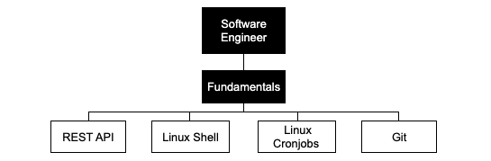

This roadmap aims to give a complete picture of the modern software engineering landscape and serve as a study guide for aspiring software engineers.

## Software Engineer Fundamentals

* [REST API](https://github.com/federicoperezmarina/101_REST_API_first_steps)
This repository is about REST API first steps.

* [Linux Shell](https://github.com/federicoperezmarina/101_linux_shell_and_shell_scripting_first_steps)
This repository is about Linux Shell first steps in commands & linux shell scripting.

* [Linux Cronjobs](https://github.com/federicoperezmarina/101_linux_cronjobs_first_steps)
This repository is about creating cronjobs in linux

* [Git](https://github.com/federicoperezmarina/101_git_first_steps)
This repository is about the most common commands in git

